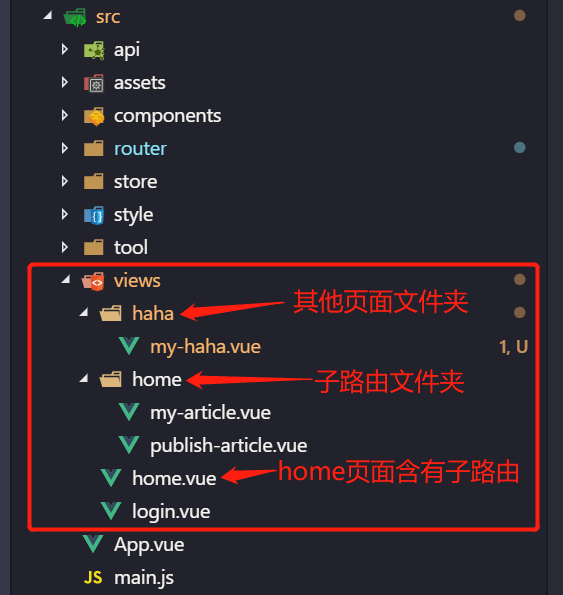
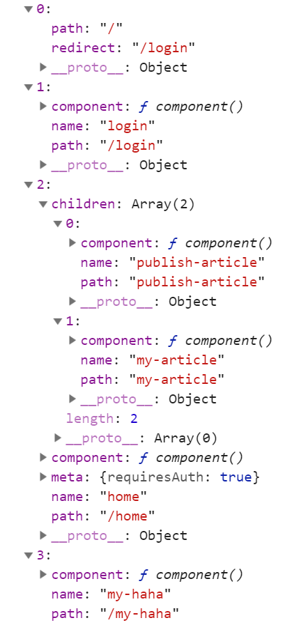

# [hzq-router](<(https://github.com/MrHzq/hzq-router)>)

## vue 路由封装插件

### 将传入的路由参数，转为 vue-router 指定的路由对象

### 安装：`npm i hzq-router -s`

### 使用：在`src/router/index.js`里面这样改造

```ruby
import Vue from 'vue'
import Router from 'vue-router'
import hzqRouter from 'hzq-router'
Vue.use(Router)

let all = Object.assign({
    '/': [
        { name: 'login' },
        {
            name: 'home',
            children: ['publish-article', 'my-article'],
            meta: { requiresAuth: true }
        }
    ]
})
let routes = hzqRouter(all)
routes.unshift({ path: '/', redirect: '/login' })

export default new Router({ routes })
```

### 使用说明

## 1. 引入`hzq-router`插件：`import hzqRouter from 'hzq-router'`

## 2. 构造你的路由数据：

```ruby
let all = {
    '/': [
        { name: 'login' },
        {
            name: 'home',
            children: ['publish-article', 'my-article'],
            meta: { requiresAuth: true }
        }
    ]
}
```

### '/'：

> 表示你页面级`.vue` 所放的位置，我是全部放在 `views` 文件夹下的；<br>
> 当`.vue` 是放在 `views`的直接下级，则使用`'/'`来表示；<br>
> 如果是放在`views/haha/**.vue`的，则使用文件名`'haha'`表示<br>

### name：

> 当没有`children`属性时，表示你的`.vue` 文件名称<br>
> 有`children`属性时，既表示你的`.vue` 文件名称，又表示你的子路由放在的文件夹名称

`'childre'`：表示你的子路由数据，是一个`Array`，里面直接存放子路由`.vue`文件的名称<br>

`'meta'`：表示你的路由元信息<br>

### 示例：

当前我的`vue`项目`src`文件

如果是以上的文件夹，则对应的路由数据应该为：

```ruby
let all = {
    '/': [
        { name: 'login' },
        {
            name: 'home',
            children: ['publish-article', 'my-article'],
            meta: { requiresAuth: true }
        }
    ],
    haha: [
        {
            name: 'my-haha'
        }
    ]
}
```

## 3. `let routes = hzqRouter(all)`：调用插件，返回 vue-router 格式的路由对象

1. `hzqRouter(p1,p2)`
    > 参数 p1：你要传递进去的路由数据，即上面的 all 对象<br>
    > 参数 p2：你页面级路由放在的文件夹名称，我这默认的是'views'

因此你可以这样使用：`hzqRouter(all,'pages')`

2. 返回结果：正儿八经的`vue-router`数据
   
    > 其中 component 使用了路由懒加载

## 4. `routes.unshift({ path: '/', redirect: '/login' })`：手动加入路由重定向
